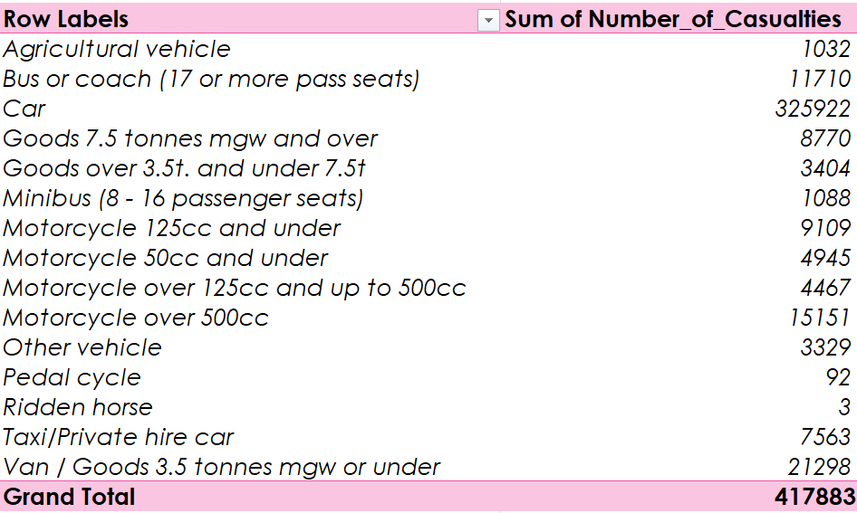
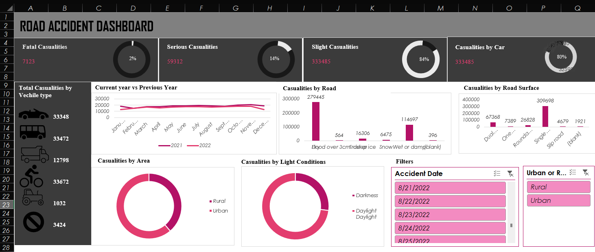

# Road Accident Excel Dashboard Analysis Practice Project

This Excel dashboard provides an in-depth analysis of road accidents, leveraging a comprehensive dataset to uncover trends, patterns, and insights. Key features of the dashboard include: Overall Trends, Geographical Distribution, Accident Severity Distribution, Contributing Factors & Vechile Involvent

This dashboard was aimed to design and provide clear, actionable insights to help stakeholders understand and mitigate the factors contributing to road accidents.

It was used to practice data visualization & cleaning on excel

Data Source: https://github.com/witrioktafiani/Road-Accident-AnalystExcel

## Link Excel

[Excel Workbook](https://docs.google.com/spreadsheets/d/17LXwpI1XN-YQbXA8mNcf6v-lUGgYsoO1/edit?usp=drive_link&ouid=104849268117202364440&rtpof=true&sd=true)

### Example of Pivot Table 

### Dashboard

